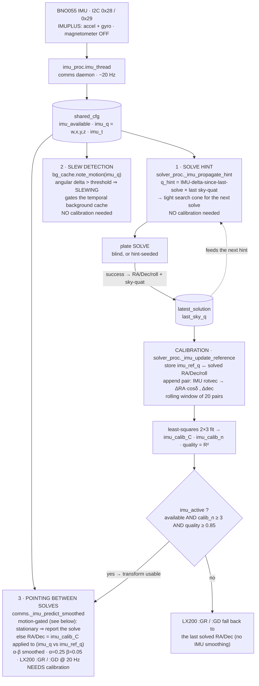
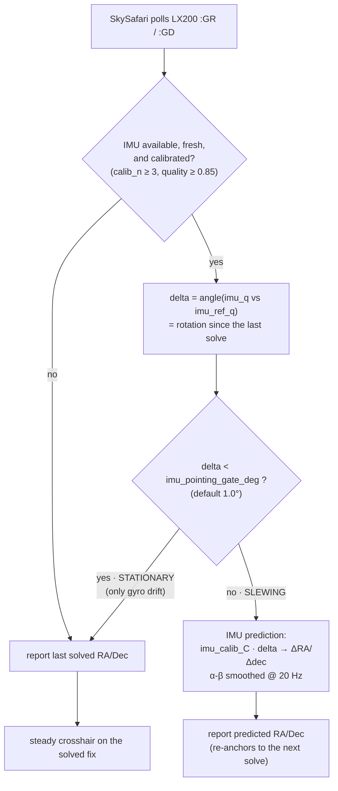

# IMU position / motion flow

How the BNO055 inertial sensor feeds position and motion information through
diofinder. One producer (a 20 Hz reader) publishes a quaternion to `shared_cfg`;
three independent consumers use it, and a calibration loop (driven by successful
plate solves) learns the IMU→sky transform that the pointing output needs.

Key distinction the diagram makes explicit:

- **Slew detection** and the **solve hint** need only *relative* quaternion
  changes — they work immediately, **no calibration required**.
- The **LX200 pointing output** between solves needs the *learned* IMU→sky
  transform (`imu_calib_C`), so it only kicks in once the IMU is "active".

---

## Flow

---

## Pointing decision for `:GR` / `:GD` (the motion gate)

The IMU prediction exists to interpolate the crosshair **during a slew** (smooth
20 Hz motion between ~1–2 Hz solves). On a **stationary** mount there is no
motion to interpolate, so the prediction would only inject IMUPLUS gyro drift —
walking a parked crosshair ~0.5° off the true (solved) position between solves,
snapping back at each solve. The motion gate suppresses that: below
`imu_pointing_gate_deg` (default 1.0°) of physical rotation since the last solve,
the device is treated as stationary and the authoritative solved position is
reported instead.

Result: a **parked scope sits still on the solved position**; the IMU only takes
over once you actually slew, then hands back to solves when motion stops. The
gate is on raw IMU rotation (independent of the calibration transform) and is
tunable via `imu_pointing_gate_deg` (config + `shared_cfg`).

---

## `shared_cfg` IMU keys

| Key | Written by | Read by | Meaning |
|---|---|---|---|
| `imu_available` | imu_thread | all consumers | BNO055 detected & responding |
| `imu_q` | imu_thread (20 Hz) | all consumers | latest quaternion (w,x,y,z) |
| `imu_t` | imu_thread | hint / pointing | monotonic timestamp (staleness check, >2 s = stale) |
| `imu_ref_q` / `imu_ref_ra_deg` / `imu_ref_dec_deg` / `imu_ref_roll_deg` / `imu_ref_t` | solver (post-solve) | comms pointing | the IMU↔sky reference captured at the last solve |
| `imu_calib_C` | solver | comms pointing | learned 2×3 IMU-rotvec → (ΔRA·cosδ, Δdec) transform |
| `imu_calib_n` | solver | active gate | number of calibration pairs (rolling, max 20) |
| `imu_pointing_gate_deg` | comms (seed from cfg) | comms pointing | stationary threshold; below it `:GR`/`:GD` report the solve (default 1.0°) |
| `imu_calib_quality` | solver | active gate | R² of the transform fit |

---

## Notes

- **IMUPLUS mode (no magnetometer)** is intentional: the magnetometer is
  unreliable near a metal mount/telescope, and absolute heading isn't needed —
  every consumer uses *relative* motion (the absolute sky frame comes from plate
  solves, not the IMU).
- **The "active" gate** (`imu_available AND imu_calib_n ≥ 3 AND quality ≥ 0.85`)
  only gates consumer ③ (pointing). Consumers ① and ② run as soon as there's a
  live quaternion.
- **Calibration is a feedback loop with a cold-start dependency:** `imu_calib_n`
  only advances on a *successful solve that followed motion* (0.1°–15° of sky
  movement between two solves). A perfectly still mount, or a run of failed
  solves, can't accumulate pairs — so the IMU may sit at `calib_n < 3` (pointing
  stays on raw solved RA/Dec) until you slew between solves a few times. Solve
  hint and slew detection are unaffected by this.
- **Failure fallbacks** keep everything degrading gracefully: a stale/absent IMU
  makes the solve hint reuse the last attitude with a tight cone, leaves slew
  detection to the solver-derived path, and makes `:GR`/`:GD` report the raw
  last solved RA/Dec.

See `docs/pipeline.md` for the detection→solve pipeline these hooks plug into.
