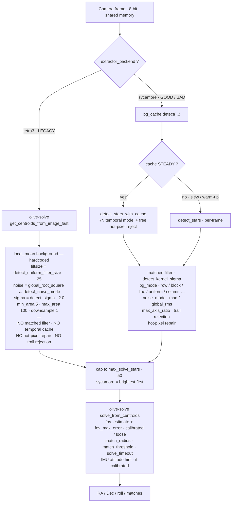
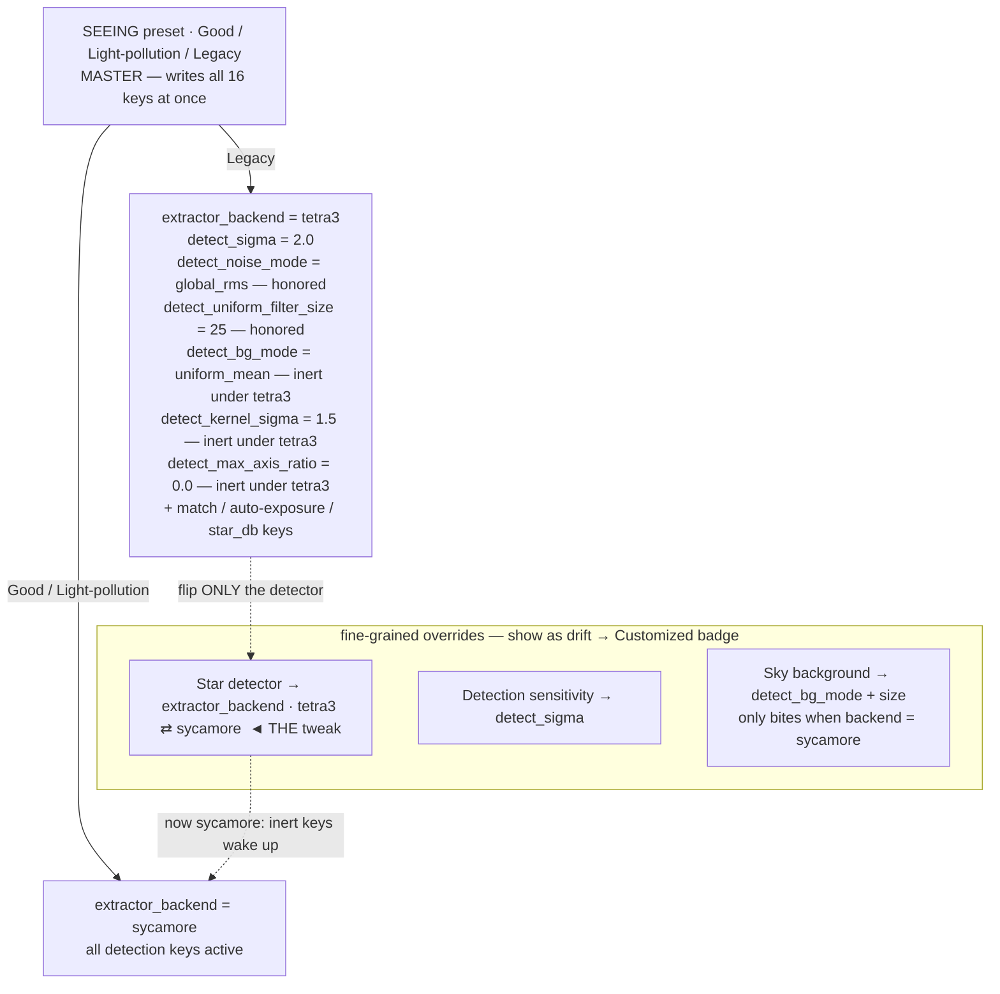

# Detection & solve pipeline

How a camera frame becomes a pointing solution, and how the three
detection-related controls (**Seeing**, **Star detection**, **Sky background**)
map onto the underlying settings.

The single most important branch is `extractor_backend`:

- **`tetra3` (the "Legacy" preset)** — an exact re-creation of AstroKeith's
  `eFinder_cli` extraction + solve (olive-solve's
  `get_centroids_from_image_fast` + its solver). It **bypasses** sycamore and
  the temporal background cache entirely.
- **`sycamore` (the "Good"/"Light-pollution" presets)** — the matched-filter
  extractor routed through `bg_cache`, with the temporal cache, hot-pixel
  repair, and trail rejection.

> **Scope note:** "Legacy = AstroKeith" applies to the *extraction + solver*.
> It still runs inside diofinder's harness — auto-exposure, calibrated FOV
> tolerance, and the IMU attitude hint wrap both backends.

---

## 1. Runtime pipeline (branches on `extractor_backend`)

---

## 2. Controls → settings (Seeing is the master; the rest are overrides)

Starting from **Legacy** and flipping **only** the Star detector to Sycamore
keeps `detect_sigma=2`, `detect_bg_mode=uniform_mean`,
`detect_noise_mode=global_rms`, `filtsize=25` — but now they run through
sycamore, so `uniform_mean`+`global_rms` is honored (the deliberate
"tetra3-reference pipeline reproduced in sycamore"), **plus** the matched-filter
gate, the temporal cache, hot-pixel repair, and trail rejection all switch on.

---

## 3. Which detection keys are honored under each backend

| Key | `tetra3` (Legacy) | `sycamore` (Good / Bad) |
|---|---|---|
| `detect_sigma` | ✅ threshold | ✅ threshold |
| `detect_noise_mode` | ✅ `global_rms` → `global_root_square` | ✅ |
| `detect_uniform_filter_size` | ✅ as `filtsize` | ✅ only when `bg_mode = uniform_mean` |
| `detect_bg_mode` | ❌ ignored (`local_mean` hardcoded) | ✅ |
| `detect_kernel_sigma` | ❌ no matched filter | ✅ |
| `detect_max_axis_ratio` | ❌ no trail rejection | ✅ |
| `detect_local_noise` | ❌ | ✅ |
| temporal `bg_cache` (√N, hot-pixel) | ❌ bypassed | ✅ |
| `max_solve_stars` | ✅ | ✅ |
| `match_radius` / `match_threshold` / fov / `solve_timeout` | ✅ (solver) | ✅ (solver) |

So **Legacy** = `local_mean` background · 25-px window · global-RMS noise ·
sigma 2 · no temporal cache · no trail rejection. The `uniform_mean` /
`kernel_sigma` / `max_axis_ratio` values it writes are inert under tetra3 — they
exist so that toggling back to Good/Bad (or just flipping the detector to
Sycamore) re-tunes cleanly.
