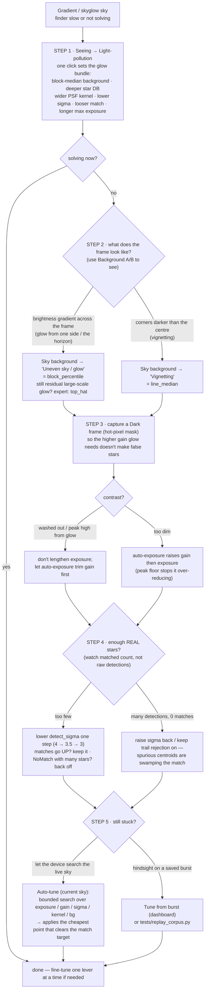

# Strategy: solving under skyglow / a gradient

Light-polluted or gradient skies give the finder a high, *uneven* background
pedestal that buries faint stars. There are a lot of levers — this is the order
to pull them, and why.

## Golden rules

1. **Start with the preset, not the individual knobs.** `Seeing → Light-pollution`
   sets ~8 levers correctly in one click. Only hand-tune *after* that.
2. **Change one lever at a time, and watch the *matched-star* count** — not the
   raw detected count. More detections with **fewer** matches means you're
   adding spurious centroids, which is worse. The **Customized** badge tells you
   you've drifted from the preset.
3. **For glow, the background-subtraction *mode* matters more than `sigma`.**
   Removing the gradient is what exposes the stars; lowering the threshold into
   the noise is a distant second.
4. **Brightness is not the fix.** More gain/exposure amplifies the glow (and its
   shot noise) along with the stars. Background subtraction + a hot-pixel mask
   beat brute brightness.

## Decision flow

## Lever reference (cheapest / safest → most involved)

| Lever | What it does | Use for glow/gradient when… | Where |
|---|---|---|---|
| **Seeing → Light-pollution** | sets the whole glow bundle at once | **always start here** | Home / Config |
| Sky background = **block_percentile** ("Uneven sky / glow") | subtracts a 2-D per-tile median → removes spatial gradients | one side brighter, smooth glow | Home |
| Sky background = **top_hat** (expert) | morphological white top-hat; removes large-scale glow a per-row floor can't see (slow ~100 ms) | severe / structured glow | Camera (expert) |
| Sky background = **line_median** ("Vignetting") | per-row floor | corners darker than centre | Home |
| **Dark frame** (hot-pixel mask) | rejects hot/warm pixels that masquerade as stars at high gain | before leaning on gain | Settings |
| **detect_sigma** ↓ | lowers the detection threshold → more faint stars (and more spurious) | too few real stars after bg fix | Home (sensitivity) |
| **detect_kernel_sigma** ↑ | widens the matched filter for bloated/blurred PSFs | poor seeing bloats stars | Camera (expert) |
| **Deep star DB** | more catalog stars available to match | faint field / few bright stars | via Light-pollution preset |
| **Auto-tune (current sky)** | bounded coordinate search for the cheapest solving point | manual tuning stalls | Camera (expert) |
| **Background A/B** | compares background modes on the live frame | choosing between bg modes | Background page |

## Why this order

The Light-pollution preset already flips the big levers (block-median background,
deeper DB, wider kernel, looser match, longer exposure ceiling) — so step 1 often
just works. When it doesn't, the **background mode** is the highest-leverage next
move because it removes the *gradient itself*; only once the field is flat does
lowering `sigma` help rather than flood the solver with noise. Gain/exposure and
the hot-pixel mask keep the star-to-background contrast healthy without inventing
false stars, and the search tools (Auto-tune / replay) are the fallback when the
manual path stalls.

See `docs/pipeline.md` for how these controls map onto the detection→solve
pipeline, and the **Seeing presets** section of `CLAUDE.md` for the exact preset
values.
